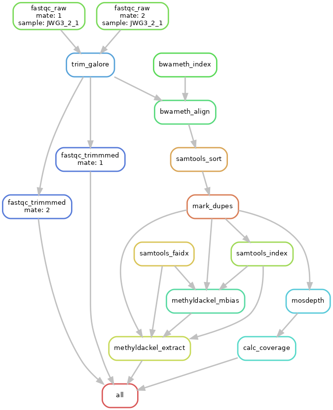

# WGBS Snakemake Workflow
This workflow is designed to run the basic steps for a whole-genome bisulfite 
sequencing experiment. It's intended to automate the workflow for future-use and
reproducibility. If you're looking for something which will do literally
everything for an experiment then this isn't the workflow you're looking for
(yet). However, if you're comfortable running the individual programs and want
to save yourself the trouble of running every step separately this will save you
time.

The advantage of running this through Snakemake is that it intelligently handles
threading and replaces completed processes up to the number of cores specified
at run-time. Individual options for the steps are mostly hard-coded, as this is
intended for reproducibility of our particular workflow. However, options for
the thread count for each step are changeable from the .yaml file.

## Getting Started
Edit the .yaml file to include your sample IDs (excluding extensions,
pair numbers, lane info, etc.) and an already bwameth-indexed reference genome.

Currently, the workflow expects an R1 and R2 file for each sample. Place the
individual .fastq.gz files for R1 and R2 into the input_data directory. Once
you have all the required dependencies installed run the workflow with:

`snakemake --cores {cores_here}`

## Dependencies
1. [Trim Galore!](https://www.bioinformatics.babraham.ac.uk/projects/trim_galore/)
2. [FastQC](https://www.bioinformatics.babraham.ac.uk/projects/fastqc/)
3. [bwa-meth](https://github.com/brentp/bwa-meth)
4. [samtools](https://www.htslib.org/)
5. [Picard Tools](https://broadinstitute.github.io/picard/)
6. [MethylDackel](https://github.com/dpryan79/MethylDackel)
7. [Mosdepth](https://github.com/brentp/mosdepth)
8. [Snakemake](https://snakemake.readthedocs.io)
9. [Python3](https://www.python.org/)

## Workflow
1. Index the reference genome with bwameth and samtools faidx
2. Quality checking, and output of sample information with FastQC
3. Adapter and quality trimming with Trim Galore!
4. Alignment to a reference genome with bwa-meth
5. Marking PCR duplicates with Picard Tools MarkDuplicates
6. Detecting methylation bias per read position with MethylDackel
7. Extracting methylation calls per position into bedGraph and methylKit formats with MethylDackel
8. Calculating depth and coverage with Mosdepth

The output from the workflow is suitable for DMR-calling or aggregation of calls
to determine % methylation per feature.

